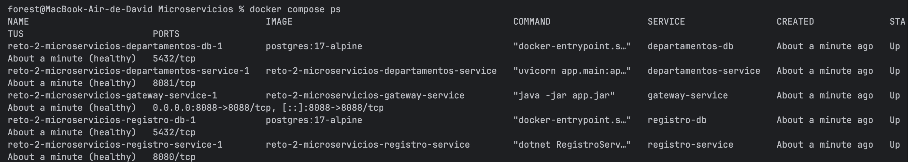
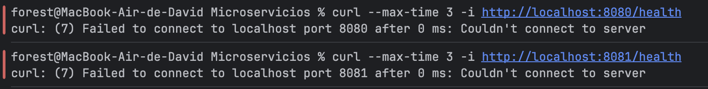
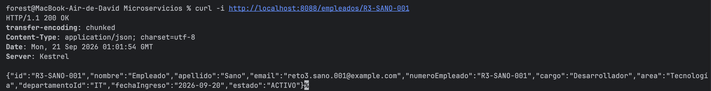
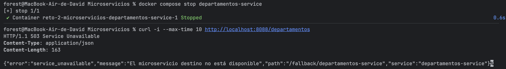
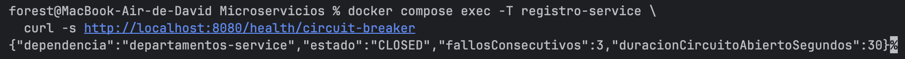
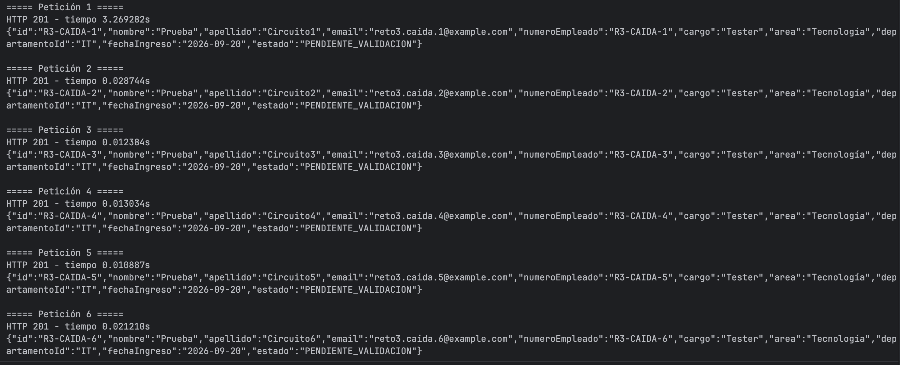
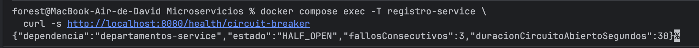
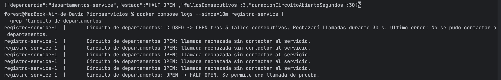
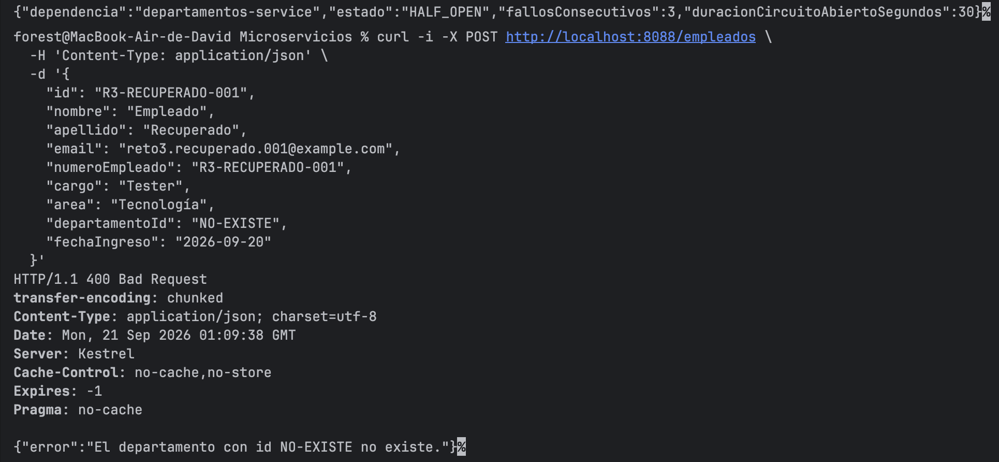
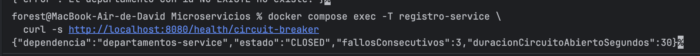

# Evidencias del Reto 3

Esta carpeta contiene las capturas obtenidas durante la demostración real del API Gateway y el Circuit Breaker.

## Lista de verificación

- [ ] `01-compose-healthy.png`
- [ ] `02-acceso-directo-rechazado.png`
- [ ] `03-recurso-por-gateway.png`
- [ ] `04-gateway-503-json.png`
- [ ] `05-circuito-closed.png`
- [ ] `06-salto-tiempos-open.png`
- [ ] `07-circuito-open.png`
- [ ] `08-transiciones-logs.png`
- [ ] `09-recuperacion-400.png`
- [ ] `10-circuito-closed-final.png`

## Cómo insertar una captura

Después de guardar la imagen en esta carpeta, puede mostrarse en este documento así:

```markdown

```

Debajo de cada imagen se recomienda registrar:

- fecha y hora de ejecución;
- comando utilizado;
- resultado observado;
- criterio del Reto 3 que demuestra;
- cualquier desviación respecto al resultado esperado.

## Resultados

### 1. Compose saludable y único puerto público



### 2. Acceso directo rechazado



### 3. Recurso funcionando por el Gateway



### 4. Respuesta 503 controlada



### 5. Estado inicial CLOSED



### 6. Salto en tiempos de respuesta



### 7. Estado OPEN y fallback



### 8. Transiciones del Circuit Breaker



### 9. Recuperación automática



### 10. Estado final CLOSED

