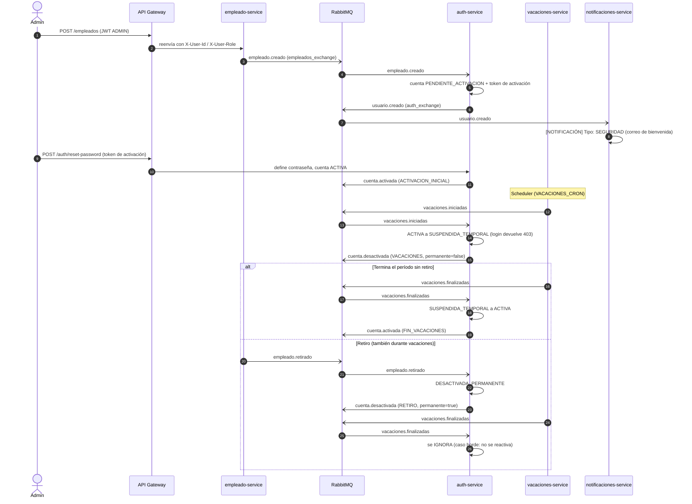

# Reto 5: Seguridad y Control de Acceso con JWT

Este documento detalla la implementación del servicio de autenticación
(`auth-service`) y las decisiones de integración tomadas para cumplir con los
requerimientos del Reto 5.

## 1. Estrategia de Validación JWT (Arquitectura Centralizada)

En lugar de crear un JWTFilter en cada microservicio (lo cual duplicaría código y rompería el principio de responsabilidad única), hemos adoptado una **arquitectura centralizada a través del API Gateway**.

*   **Generación:** Solo el uth-service genera y firma los JWT.
*   **Validación:** El gateway-service intercepta todas las peticiones a rutas protegidas. Utilizando la misma clave secreta, el Gateway verifica matemáticamente la firma del token, su vigencia (exp) y el rol (
ole).
*   **Propagación de Identidad:** Una vez validado, el Gateway elimina las cabeceras de identidad proporcionadas por el cliente e inyecta el ID y rol verificados en `X-User-Id` y `X-User-Role`. Después reenvía la petición al microservicio correspondiente, que no necesita importar librerías JWT.

## 2. Instrucciones: Cómo obtener un token (Flujo de Login)

Para obtener un Access JWT, se debe realizar una petición POST al endpoint público de login. 
*(Asegúrese de que el proyecto Spring Boot esté en ejecución en el puerto asignado)*.

**Endpoint:** POST /auth/login
**Headers:** Content-Type: application/json

**Body:**
``json
{
  "email": "admin@empresa.com",
  "password": "admin123"
}
``

**Respuesta Exitosa (200 OK):**
``json
{
  "token": "eyJhbGciOiJIUzI1NiJ9.eyJyb2xlIjoiQURNSU4iLCJzdWI..."
}
``

### El Usuario Administrador (Seed)
Al arrancar la aplicación por primera vez, un componente llamado AdminSeeder verifica si existe el administrador. Si no existe, crea automáticamente la cuenta dmin@empresa.com con contraseña dmin123 y rol ADMIN.

## 3. Manejo de Contraseñas y Seguridad
*   **Política de contraseña:** `newPassword` en `/auth/reset-password` y `/auth/change-password` exige entre 8 y 72 caracteres con al menos una letra y un número (responde 400 si no la cumple).
*   **Estado al restablecer:** solo la primera activación (`PENDIENTE_ACTIVACION` a `ACTIVA`) cambia el estado y publica `cuenta.activada`. Recuperar la contraseña de una cuenta `ACTIVA` o `SUSPENDIDA_TEMPORAL` solo cambia la clave: no reactiva una suspensión.
*   **Algoritmo:** Todas las contraseñas se almacenan fuertemente hasheadas usando BCryptPasswordEncoder de Spring Security. Nunca se guardan contraseñas en texto plano.
*   **Tokens Desechables:** Para recuperar contraseñas, no se envía la clave por correo. En su lugar, el sistema genera un **Reset Token** (validez de 15 minutos, con claim "type": "RESET_PASSWORD"). Este token viaja en el cuerpo del JSON (no como Bearer) hacia el endpoint POST /auth/reset-password.
*   **Clave Secreta JWT:** La clave secreta para firmar los tokens debe ser de al menos 256 bits (32 caracteres). Esta se configura vía variables de entorno en el archivo pplication.yaml o .env bajo la llave jwt.secret.

## 4. Gestión Global de Excepciones
Para garantizar un estándar en las respuestas de error y evitar que se filtren trazas de Java al cliente, se implementó un RestExceptionHandler (@RestControllerAdvice).
Este componente captura excepciones personalizadas (UnauthorizedException, ResourceNotFoundException, etc.) y validaciones de DTOs (@Valid), formateándolas en un ResponseDTO estándar.

## 5. Eventos y RabbitMQ
auth-service consume `empleados_exchange` (cola `auth.empleados`, con DLQ `auth.empleados.dlq`) y deduplica con la tabla `ProcessedEvent` (patrón Inbox):

| Evento recibido | Efecto en la cuenta | Evento publicado en `auth_exchange` |
| :--- | :--- | :--- |
| `empleado.creado` | Cuenta `PENDIENTE_ACTIVACION` | `usuario.creado` (con token de activación) |
| `empleado.retirado` | `DESACTIVADA_PERMANENTE` | `cuenta.desactivada` (permanente) |
| `vacaciones.iniciadas` | `SUSPENDIDA_TEMPORAL` | `cuenta.desactivada` (VACACIONES) |
| `vacaciones.finalizadas` | `ACTIVA` (se ignora si está desactivada permanente) | `cuenta.activada` |

`/auth/recover-password` publica `usuario.recuperacion`. notificaciones-service consume `auth_exchange` (cola `notificaciones.auth`). Los campos de `data` de los eventos de auth están centralizados en `AuthEventPayloads` y deben validarse contra el Catálogo de Eventos.

### Diagrama de secuencia del ciclo de vida de la cuenta

Todos los eventos usan el mismo envelope (`id`, `type`, `version` como texto `"1.0"`, `occurredAt`, `producer`, `data`),
publicado siempre por `AuthEventPublisher`. Los campos de `data` se construyen solo en `AuthEventPayloads`.

## 6. Despliegue y Configuracion Docker
Como desarrollador de este microservicio, se incluye toda la configuracion necesaria para conectarlo al ecosistema general.

### Archivo .env
Copie `.env.example` a `.env` (ya incluye todas las variables de auth-service). Las propias de este servicio son:
JWT_SECRET_KEY=<al menos 32 bytes; igual en auth-service y gateway-service>
ADMIN_EMAIL=admin@empresa.com
ADMIN_PASSWORD=<contraseña del administrador semilla; cámbiela>
AUTH_DB_NAME=auth_db
AUTH_DB_USER=auth_user
AUTH_DB_PASSWORD=<contraseña>
AUTH_SERVICE_URL=http://auth-service:8089

Si una BD falla con "password authentication failed", el volumen de Docker conserva credenciales de una ejecución anterior: elimine ese volumen (`docker volume rm`) y vuelva a levantar.

### docker-compose.yml
`auth-db` y `auth-service` están integrados en el `docker-compose.yml` global.
El puerto 8089 solo se expone dentro de la red de Docker; desde el host se debe
acceder a `/auth/**` mediante el Gateway en el puerto 8088.

## 7. Scheduler de vacaciones (Integrante 4)

`vacaciones-service` ejecuta `VacationScheduler` con `@Scheduled` y
`@EnableScheduling`. La frecuencia se configura con `VACACIONES_CRON`, que
acepta la sintaxis Spring de seis campos y por defecto ejecuta cada minuto
(`0 * * * * *`). Las fechas de los períodos son inclusivas: el inicio se
procesa cuando `fechaInicio <= hoy`; el fin, cuando `fechaFin < hoy`.
Así, las vacaciones de un día son válidas y duran hasta acabar ese día.

Cada cambio se guarda en la BD y, después del commit, se publica en
`empleados_exchange` el evento `vacaciones.iniciadas` o
`vacaciones.finalizadas`, con `version` como string `"1.0"`. El servicio no
finaliza ni cancela anticipadamente un período `EN_CURSO` cuando procesa
`empleado.retirado`; el evento de fin debe emitirse igualmente para que
`auth-service` lo deduplique/ignore si la cuenta ya quedó permanentemente
desactivada.

Para una demostración inmediata sin cambiar fechas ni esperar el cron, habilita
`VACACIONES_MANUAL_ENABLED=true` en `.env` y recrea el contenedor de vacaciones.
Con el token `ADMIN`, usa `POST /vacaciones/{id}/forzar-inicio` y
`POST /vacaciones/{id}/forzar-fin`. Son endpoints de desarrollo deshabilitados
por defecto; el API Gateway exige rol `ADMIN` para toda escritura de vacaciones.
El flujo automatizado del scheduler, los payloads y la secuencia completa se
validan con `mvn -f vacaciones-service/pom.xml test`.

La tarea periódica corre en cada réplica: escalar el servicio a N instancias
puede publicar N veces. La deduplicación del consumidor limita efectos
duplicados, pero no el trabajo del productor. Se acepta instancia única en este
reto; ShedLock queda para el Reto 31.

## 8. Colección Postman y flujo de integración

Importa [`reto5-integracion.postman_collection.json`](./reto5-integracion.postman_collection.json)
en Postman. La colección usa el Gateway `http://localhost:8088`, inicia sesión
con `admin@empresa.com` / `admin123` y guarda automáticamente los JWT de admin
y de los empleados. Requiere Docker Compose arriba y el departamento `IT`
(la colección lo crea antes de dar de alta empleados).

Los eventos de onboarding y recuperación son asíncronos: tras crear E001/E002
o recuperar contraseña, espera a que `auth-service` procese el evento y copia el
`tokenRecuperacion` de los logs/evento de `notificaciones-service` en la
variable de colección `resetTokenE001` o `resetTokenE002` antes de ejecutar el
request de reset correspondiente. Repite los requests de login si una cuenta
todavía no ha sido creada por el consumidor. Deja también que los consumidores
de RabbitMQ procesen `vacaciones.iniciadas`, `vacaciones.finalizadas` y
`empleado.retirado` antes de ejecutar el siguiente login; en Collection Runner
puedes definir un delay de 1–2 segundos y comprobar los logs de
`auth-service`/`vacaciones-service`.

El recorrido implementa las 18 verificaciones sugeridas en el reto:

1. Iniciar los servicios y obtener el JWT ADMIN semilla.
2. Crear E001 y confirmar `empleado.creado` / `usuario.creado`.
3. Probar acceso protegido con JWT ausente o inválido (`401`).
4. Establecer contraseña con el token de activación.
5. Iniciar sesión como USER.
6. Leer `/empleados` con el JWT (`200`).
7. Solicitar recuperación de contraseña y revisar `usuario.recuperacion`.
8. Restablecer la contraseña y volver a iniciar sesión.
9. Intentar retirar E001 como USER (`403`).
10. Leer y actualizar el perfil propio (`200`).
11. Intentar actualizar el perfil de E002 como E001 (`403`).
12. Cambiar la contraseña; la anterior falla (`401`) y la nueva permite login.
13. Crear vacaciones hoy-hoy para E001 y confirmar `vacaciones.programadas`.
14. Iniciar vacaciones y confirmar rechazo de login mientras está suspendido.
15. Finalizar vacaciones y confirmar que el login vuelve a funcionar.
16. Retirar E002 durante `EN_CURSO`, publicar fin y comprobar que su login sigue bloqueado.
17. Hacer offboarding de E001 con ADMIN; su login debe fallar.
18. Consultar `GET /empleados?estado=RETIRADO` y verificar `fechaRetiro`.

Los requests auxiliares de crear el departamento, dar de alta E002 y recoger los
tokens de activación/restablecimiento son parte del orden de ejecución de la
colección; las comprobaciones de estado HTTP están automatizadas en sus tests.

## 9. Decisiones y limitaciones conocidas

*   **Validación solo en el Gateway.** Los microservicios internos no exponen puertos al host y confían en `X-User-Id` / `X-User-Role`, que el Gateway reescribe a partir de claims verificados. Es una decisión consciente para no duplicar un filtro JWT en cinco lenguajes distintos.
*   **Swagger / BearerAuth.** El esquema `BearerAuth` (JWT) se declara únicamente en el Gateway (`/swagger-ui.html`), que es el único punto de entrada; los servicios internos no se consumen directamente.
*   **Access JWT sin revocación.** El Gateway valida firma y expiración, no el estado de la cuenta. Una cuenta suspendida o retirada conserva un token ya emitido hasta que expira (1 hora); el login sí falla de inmediato.
*   **Reset/activation token reutilizable.** Es un JWT (`type=RESET_PASSWORD`, 15 min en recuperación, 1 h en activación) y no se invalida tras usarse. No sirve como access token: el Gateway rechaza cualquier token con claim `type`, y auth-service exige ese claim en `/auth/reset-password`.
*   **Algoritmo de firma.** HMAC-SHA256 fijado explícitamente en auth-service (`Jwts.SIG.HS256`); el header del JWT incluye `"alg":"HS256"` y `"typ":"JWT"`, y el contenido lleva `jti` (UUID único por token) además de `sub`, `role`, `iat` y `exp`, sin importar la longitud del secret. Auth y Gateway deben compartir el mismo `JWT_SECRET_KEY` (mínimo 32 bytes; ambos fallan al arrancar si no está definido o es más corto). No existe un valor por defecto en el código.
*   **Scheduler con N instancias.** Ver sección 7 (ShedLock en el Reto 31).
*   **Admin semilla.** Se crea con `ADMIN_EMAIL` / `ADMIN_PASSWORD` (`.env.example` trae `admin@empresa.com` / `admin123` y docker-compose los pasa al contenedor). `ADMIN_PASSWORD` y `JWT_SECRET` ya no tienen valor por defecto en `application.yaml`; para correr fuera de Docker hay que definirlas. La contraseña nunca se escribe en los logs. Cámbiela fuera de entornos de prueba.
